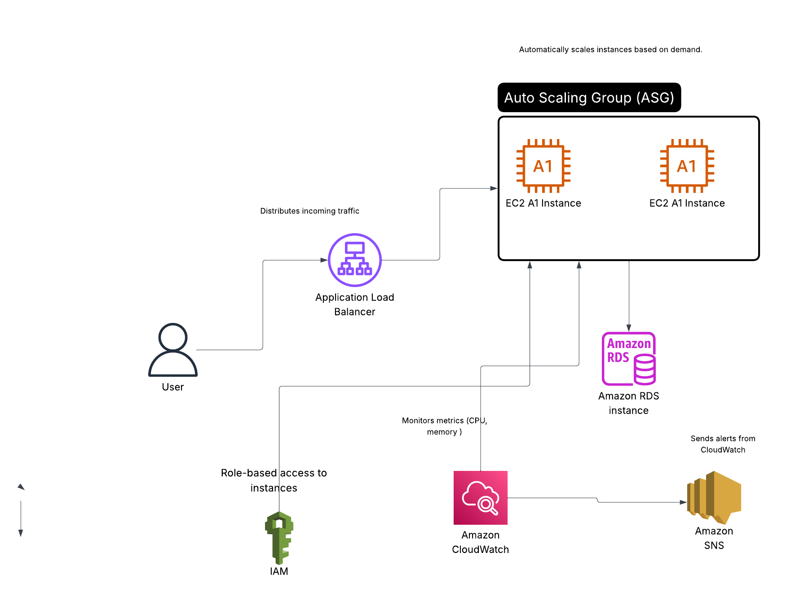

# aws-scalable-webapp-project

| Requirement                         |  Description                                                                                   |
| ----------------------------------- | ---------------------------------------------------------------------------------------------- |
| **EC2 instances**                   | Two EC2 A1 instances inside the Auto Scaling Group (ASG) represent scalable compute resources. |
| **Auto Scaling Group (ASG)**        | Automatically adjusts the number of EC2 instances based on demand.                             |
| **Application Load Balancer (ALB)** | Distributes incoming traffic evenly among the EC2 instances for high availability.             |
| **Amazon RDS (optional)**           | Centralized managed database for the web app (MySQL/PostgreSQL).                               |
| **IAM**                             | Manages role-based access control for EC2 and other AWS services.                              |
| **CloudWatch**                      | Monitors system metrics (CPU, memory, etc.) for EC2 and RDS.                                   |
| **SNS**                             | Sends alerts triggered by CloudWatch metrics.                                                  |
| **High Availability & Scalability** | Achieved through ALB + ASG combination.                                                        |
| **Monitoring & Alerts**             | CloudWatch + SNS integration ensures proactive monitoring.                                     |

Explanation of Each Component
-------------------------------------------------------

User

End-users access the web application via a browser or client.

Requests go through the Application Load Balancer.

------------------------

Application Load Balancer (ALB)

Routes incoming traffic across multiple EC2 instances.

Ensures fault tolerance — if one instance fails, traffic is rerouted automatically.

------------------------------

Auto Scaling Group (ASG) with EC2 Instances

Contains multiple EC2 instances running the web application.

Auto Scaling adjusts instance count based on CPU usage or incoming traffic.

-----------------------------------------------------------

Amazon RDS

Hosts the application’s relational database.

Multi-AZ configuration ensures data availability and durability.

-----------------------------------------------------------
IAM

Controls access permissions.

Grants roles to EC2, RDS, and CloudWatch for secure communication.
----------------------------------------------------------------------------
CloudWatch

Collects metrics such as CPU utilization, memory usage, and network throughput.

Triggers alarms when thresholds are breached.
------------------------------------------------------------------------------
SNS (Simple Notification Service)

Sends notifications (email/SMS) to admins when CloudWatch alarms are triggered.

###########################################

# Project 1: Scalable Web Application with ALB and Auto Scaling

##  Overview
This project demonstrates how to deploy a **highly available and scalable web application** on AWS using **EC2 instances, Application Load Balancer (ALB), and Auto Scaling Groups (ASG)**. It follows AWS best practices for compute scalability, monitoring, and cost optimization.

---

 Architecture Components

### 1. Application Load Balancer (ALB)
- Distributes incoming web traffic across multiple EC2 instances.
- Ensures high availability and fault tolerance.

### 2. Auto Scaling Group (ASG)
- Automatically adjusts the number of EC2 instances based on traffic demand or CloudWatch metrics.
- Maintains desired performance at minimum cost.

### 3. EC2 Instances
- Host the web application code.
- Scale dynamically according to ASG policies.

### 4. Amazon RDS (Optional)
- Managed relational database (MySQL/PostgreSQL).
- Configured with Multi-AZ deployment for high availability.

### 5. IAM Roles
- Provides secure, role-based access for EC2, RDS, and CloudWatch.
- Eliminates the need for static credentials.

### 6. Amazon CloudWatch
- Monitors EC2 and RDS metrics (CPU, memory, latency, etc.).
- Triggers alarms when metrics exceed thresholds.

### 7. Amazon SNS
- Sends alerts and notifications (email/SMS) based on CloudWatch alarms.

---

# Solution Architecture Diagram

---

# Deployment Steps 
1. Launch an EC2 instance using an Amazon Linux 2 AMI.
2. Install and configure a simple web server (e.g., Apache or Nginx).
3. Create an **Auto Scaling Group** and attach it to an **Application Load Balancer**.
4. Configure scaling policies based on CPU utilization.
5. (Optional) Set up an **Amazon RDS** database and connect it to your web app.
6. Configure **IAM roles** for secure access.
7. Set up **CloudWatch alarms** and link them to **SNS topics** for notifications.

---

I used CloudFormation  to create template.yml that also already added to my repo and the aim of that file to create resources that i used in this project like 

| Section                           | Purpose                                                                     | What It Creates                     
| --------------------------------- |-----------------------------------------------------------------------------|--------------------------------------------------------- |
| **Parameters**                    | Defines input variables (like EC2 key pair, instance type, DB credentials). | Lets you reuse the template easily.                                                                                               
| **VPC, Subnets, Gateway, Routes** | Creates the **network environment**.                                        | A VPC with 2 public subnets and internet access.                                                                                    
| **Security Groups**               | Define **firewall rules**.                                                  | - `ALBSG`: allows HTTP from the internet.  - `WebServerSG`: allows HTTP from ALB.  - `RDSSG`: allows DB access from EC2 only. 
| **LaunchTemplate**                | Defines how each EC2 instance should be configured.                         | Installs Apache and displays a test web page.                                                                                       
| **ALB (Load Balancer)**           | Distributes incoming requests.                                              | Spreads traffic across EC2 instances.                                                                                               
| **TargetGroup & Listener**        | Connect ALB to EC2 instances.                                               | Handles health checks and traffic forwarding.                                                                                       
| **AutoScalingGroup (ASG)**        | Enables scaling up/down automatically.                                      | Adds or removes EC2 instances based on traffic.                                                                                     
| **RDSInstance**                   | Creates a managed MySQL database.                                           | Stores application data securely in the same VPC.                                                                                   
| **CloudWatch + SNS**              | Enables monitoring and alerts.                                              | Sends an email if CPU > 70% for 5 minutes.                                                                                          
| **Outputs**                       | Displays useful values after deployment.                                    | The ALB DNS name (URL of your app).                             

and also i used aws cli to upload template.yaml 

aws cloudformation create-stack \
  --stack-name scalable-webapp \
  --template-body file://template.yaml \
  --parameters \
    ParameterKey=KeyName,ParameterValue=manara-key \
    ParameterKey=DBUsername,ParameterValue=admin \
    ParameterKey=DBPassword,ParameterValue=admin \
  --capabilities CAPABILITY_IAM

#  Learning Outcomes
- Deploy a secure and scalable web application on AWS EC2.
- Implement high availability with ALB and ASG.
- Use CloudWatch and SNS for proactive monitoring.
- Optimize cost through automatic scaling policies.

## Author
**Mansour Ahmed Masour**  
